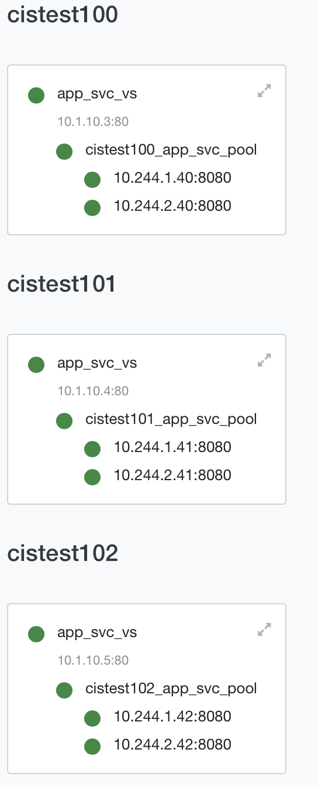

= F5 Container Ingress Service
:toc: manual

== Installation

=== Install on kube-system

[source, bash]
.*Get Code*
----
git clone https://github.com/cloudadc/container-ingress.git
cd container-ingress/f5-cis/install-on-kube-system/
----

[source, bash]
.*Install*
----
kubectl create secret generic bigip-login --from-literal=username=admin --from-literal=password=admin.F5demo.com -n kube-system
kubectl create serviceaccount bigip-ctlr -n kube-system
kubectl create -f rbac.yaml
kubectl create -f cis.yaml
----

[source, bash]
.*Uninstall*
----
cd install-on-kube-system/
kubectl delete -f cis.yaml 
kubectl delete -f rbac.yaml
kubectl delete serviceaccount bigip-ctlr -n kube-system
kubectl delete secret bigip-login -n kube-system
----

=== Install on bigip-ctlr

[source, bash]
.*Get Code*
----
git clone https://github.com/cloudadc/container-ingress.git
cd container-ingress/f5-cis/install-on-bigip-ctlr/
----

[source, bash]
.*Install*
----
kubectl create ns bigip-ctlr
kubectl create secret generic bigip-login --from-literal=username=admin --from-literal=password=admin.F5demo.com -n bigip-ctlr
kubectl create serviceaccount bigip-ctlr -n bigip-ctlr
kubectl create -f rbac.yaml
kubectl create -f cis.yaml
----

[source, bash]
.*Uninstall*
----
cd install-on-bigip-ctlr/
kubectl delete -f cis.yaml
kubectl delete -f rbac.yaml
kubectl delete serviceaccount bigip-ctlr -n bigip-ctlr
kubectl delete secret bigip-login -n bigip-ctlr
kubectl delete ns bigip-ctlr
----

== Namespaces isolation

=== --namespace-label

As depicted in below figure:

image:namespaces-isolation/namespace-isolation.png[]

* 同一个 K8S 内，一个 CIS 可只监控一个分区，多个 CIS 并行工作，确保了容器计算层 CIS 的性能
* 同一个 K8S 内的 Service 可以发布到不同的 F5 HW/VE，确保了容器路由层 F5 的性能

[source, bash]
.*1. cis argument*
----
"--namespace-label=cis_scanner_zone=zone_1",
----

[source, bash]
.*2. Get Code*
----
git clone https://github.com/cloudadc/container-ingress.git
cd container-ingress/f5-cis/namespaces-isolation
----

[source, bash]
.*3. Deploy 4 apps within 4 namespaces*
----
kubectl create -f cis.yaml

$ kubectl get ns --show-labels | grep cistest10* 
cistest100        Active   78s     cis_scanner_zone=zone_1
cistest101        Active   78s     cis_scanner_zone=zone_1
cistest102        Active   78s     cis_scanner_zone=zone_1
cistest103        Active   78s     <none>
----

the first 3 namespace has cis_scanner_zone, the cistest103 didn't.

[source, bash]
.*4. deploy ingresses*
----
kubectl apply -f ingress.yaml
----

there will be 4 ingress object created, only the first 3 will deploy to F5 due to the namespace isolation.

image:namespaces-isolation/f5-cis-ingress.png[]

[source, bash]
.*5. deploy configmap*
----
kubectl apply -f cm.yaml 
----

there will be 4 configmaps created, only the first 3 will deploy to F5 due to the namespace isolation.

== CIS Robust Test

=== Re-create CIS POD

[source, bash]
----
// CIS + AS3 Deploy 2 services
kubectl create -f cis.yaml
kubectl apply -f deploy.yaml
kubectl apply -f cm.1.yaml

// Execute the following commands simultaneously to deploy 3rd service
kubectl delete pod $(kubectl get pods -n bigip-ctlr --no-headers | awk '{print $1}') -n bigip-ctlr
kubectl apply -f cm.2.yaml

// Force cistest101 pod restart
kubectl delete pod $(kubectl get pods -n cistest101 --no-headers | awk '{print $1}') -n cistest101

//Delete all service
kubectl delete -f cm.2.yaml
----

Refer to link:cis-pod-restart/README.adoc[link] for more details.

=== Re-start F5 VE

Refer to link:f5-restart/README.adoc[link] for detailed steps.
