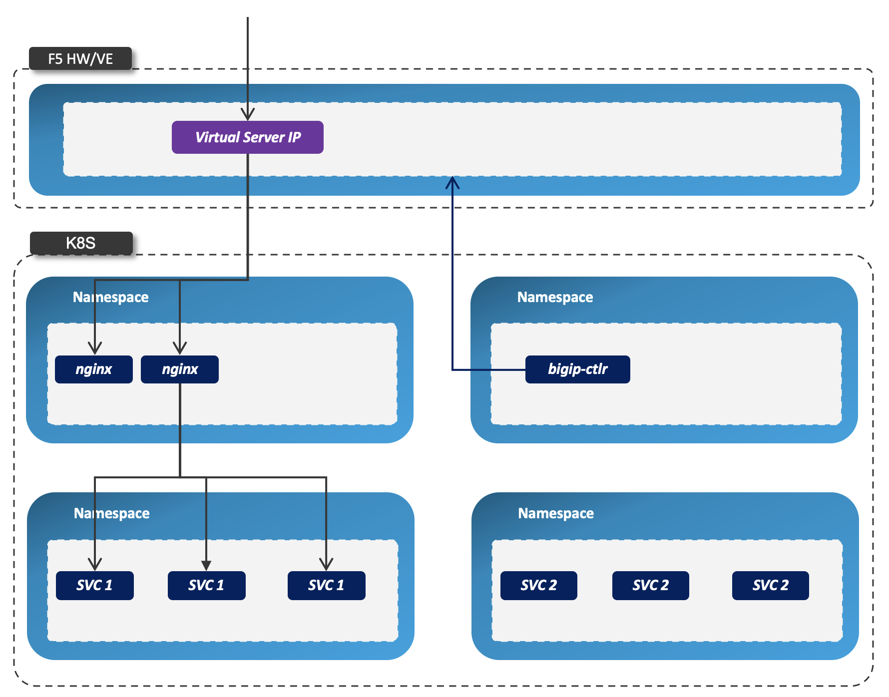
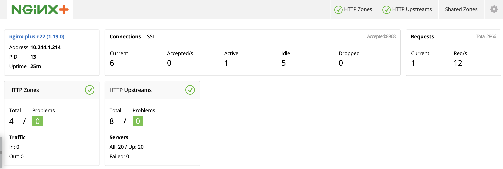
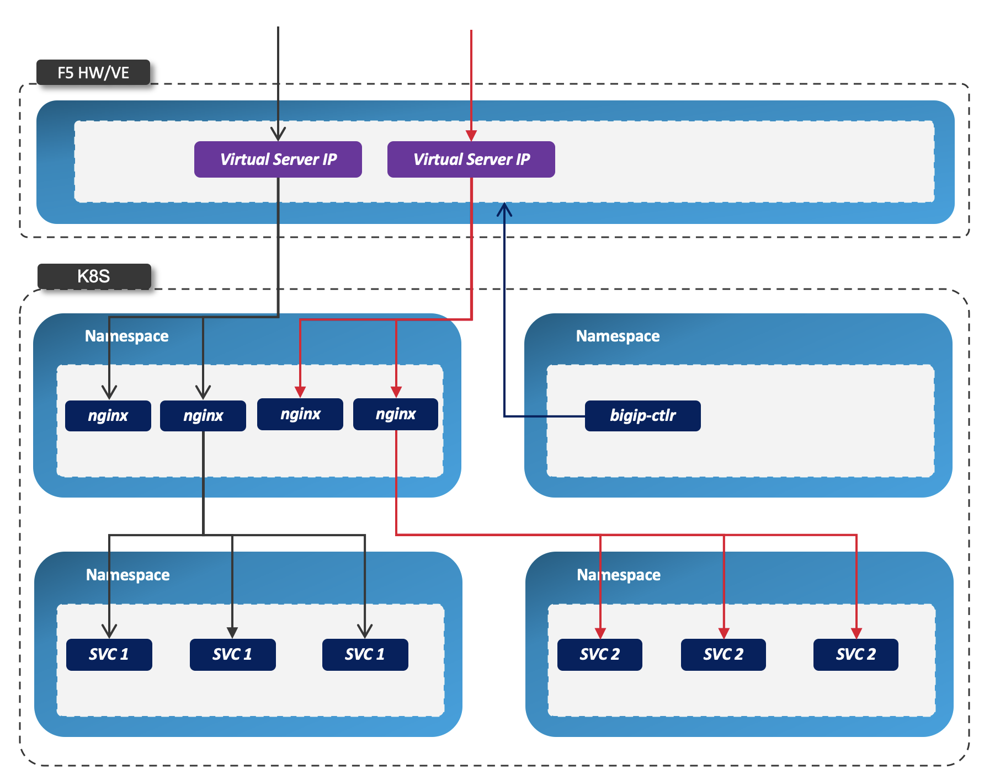
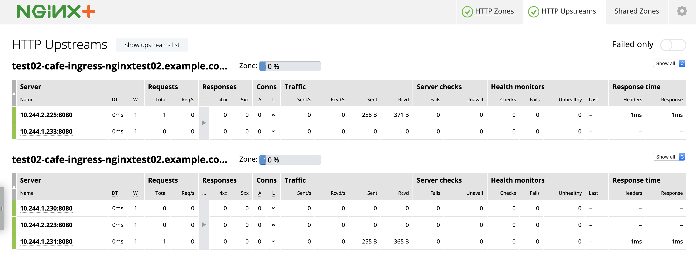
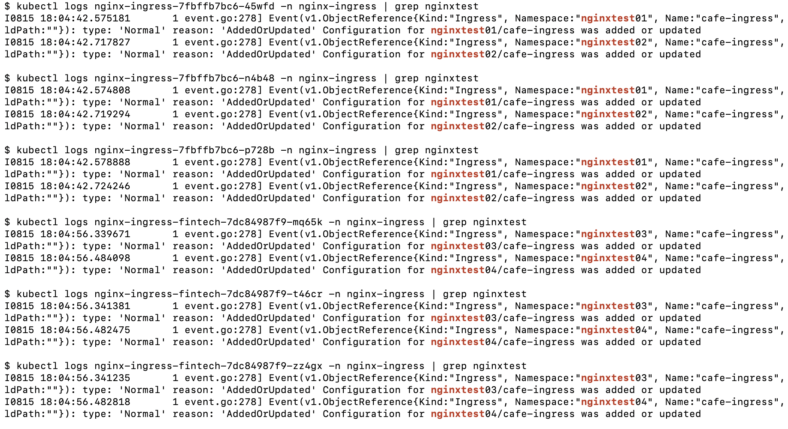

= Deployment Architectures
:toc: manual

Depends on the Ingress Controller's monitoring scope(cluster wide, single namespace base on ingress class), there are 3 types deployment architectures, BIG-IP used as external ingress controler for Nginx Plus Ingress controller.

== BIG-IP with Cluster-wide Ingress Controller

=== Architectures

* Nginx Controller has multiple replicas
* Nginx Controller play as cluster-wide ingress control
* BIGIP Virtual Server IP is the external enterence for all nginx replicas
* `bigip-ctlr` deploy BIGIP Virtual Server nginx pod as pool member

[source, bash]
.*Get Code*
----
git clone https://github.com/cloudadc/container-ingress.git
cd container-ingress/nginx-plus-ingress/bigip/cluster-wide/
----

[source, bash]
.*Set up*
----
// 1. deploy cluster wide nginx ingress controller
kubectl apply -f ns-and-sa.yaml
kubectl apply -f rbac.yaml
kubectl apply -f default-server-secret.yaml
kubectl apply -f nginx-config.yaml
kubectl apply -f vs-definition.yaml
kubectl apply -f vsr-definition.yaml
kubectl apply -f ts-definition.yaml
kubectl apply -f nginx-plus-ingress.yaml

// 2. deploy bigip controller
kubectl create ns bigip-ctlr
kubectl create secret generic bigip-login --from-literal=username=admin --from-literal=password=admin.F5demo.com -n bigip-ctlr
kubectl create serviceaccount bigip-ctlr -n bigip-ctlr
kubectl apply -f rbac-cis.yaml
kubectl apply -f cis-nginx.yaml
kubectl apply -f nginx-plus-ingress-svc.yaml
kubectl apply -f nginx-plus-ingress-configmap.yaml
----

=== Examples

[source, bash]
.*1. Set up*
----
kubectl apply -f example-deploy.yaml
kubectl apply -f example-ingress.yaml
----

This will create 4 namespaces, and each namespace has 2 services `coffee` and `tea`, also there are 4 ingress resources be create in 4 namespaces accordingly, each has reference a hostname, the path to different the 2 services in each namespace. 

[source, bash]
.*3. Check the nginx ingress controller pod log, all ingress be registered on each controller*
----
for i in $(kubectl get pods -n nginx-ingress --no-headers | awk '{print $1}') ; do echo "$ kubectl logs $i -n nginx-ingress | grep nginxtest" ; kubectl logs $i -n nginx-ingress | grep nginxtest ; echo ; done
----

the above commands output likes:

image:img/nginx-ingress-cluster-wide-log.png[]

this hints all 4 ingress resources be deployed to all 3 ingress controller pod. 

[source, bash]
.*4. Test*
----
for i in 1 2 3 4 ; do curl http://nginxtest0$i.example.com/coffee ; echo ; done
for i in 1 2 3 4 ; do curl http://nginxtest0$i.example.com/tea ; echo ; done
----

the response of coffee service looks like

[source, bash]
----
Server address: 10.244.1.223:8080
Server name: coffee-688fbd68f8-qxzv8
Date: 15/Aug/2020:14:22:16 +0000
URI: /coffee
Request ID: 506d7afa8eebbd99c26477d241139333
----

and the response of tea service looks

[source, bash]
----
Server address: 10.244.1.218:8080
Server name: tea-67c78c85b8-x4tkv
Date: 15/Aug/2020:14:22:26 +0000
URI: /tea
Request ID: afbfa92684bc5e15c7ad588c77205736
----

[source, bash]
.*5. Check nginx access log*
----
for i in $(kubectl get pods -n nginx-ingress --no-headers | awk '{print $1}') ; do echo "$ kubectl logs $i -n nginx-ingress | grep coffee" ; kubectl logs $i -n nginx-ingress | grep coffee ; echo ; done
$ kubectl logs nginx-ingress-658848c866-q9hmb -n nginx-plus-ingress | grep coffee
10.1.10.61 - - [12/Jul/2020:10:15:50 +0000] "GET /coffee HTTP/1.1" 200 161 "-" "curl/7.29.0" "-"

$ kubectl logs nginx-ingress-658848c866-wgq7b -n nginx-plus-ingress | grep coffee
10.1.10.61 - - [12/Jul/2020:10:15:50 +0000] "GET /coffee HTTP/1.1" 200 162 "-" "curl/7.29.0" "-"

$ kubectl logs nginx-ingress-658848c866-z9tcd -n nginx-plus-ingress | grep coffee
10.1.10.61 - - [12/Jul/2020:10:15:50 +0000] "GET /coffee HTTP/1.1" 200 162 "-" "curl/7.29.0" "-"
10.1.10.61 - - [12/Jul/2020:10:15:50 +0000] "GET /coffee HTTP/1.1" 200 162 "-" "curl/7.29.0" "-"

for i in $(kubectl get pods -n nginx-ingress --no-headers | awk '{print $1}') ; do echo "$ kubectl logs $i -n nginx-ingress | grep tea" ; kubectl logs $i -n nginx-ingress | grep tea ; echo ; done
$ kubectl logs nginx-ingress-658848c866-q9hmb -n nginx-plus-ingress | grep tea
10.1.10.61 - - [12/Jul/2020:10:16:37 +0000] "GET /tea HTTP/1.1" 200 155 "-" "curl/7.29.0" "-"

$ kubectl logs nginx-ingress-658848c866-wgq7b -n nginx-plus-ingress | grep tea
10.1.10.61 - - [12/Jul/2020:10:16:37 +0000] "GET /tea HTTP/1.1" 200 156 "-" "curl/7.29.0" "-"

$ kubectl logs nginx-ingress-658848c866-z9tcd -n nginx-plus-ingress | grep tea
10.1.10.61 - - [12/Jul/2020:10:16:36 +0000] "GET /tea HTTP/1.1" 200 156 "-" "curl/7.29.0" "-"
10.1.10.61 - - [12/Jul/2020:10:16:37 +0000] "GET /tea HTTP/1.1" 200 156 "-" "curl/7.29.0" "-"
----

NOTE: The 4 continue request be 3 nginx controller with `Least Connections Member` algorithm.

[source, bash]
.*6. Check config change*
----
kubectl exec -it nginx-ingress-7fbffb7bc6-j7fqk -n nginx-ingress -- bash

$ cd /etc/nginx/conf.d/
$ ls 
nginxtest01-cafe-ingress.conf  nginxtest02-cafe-ingress.conf  nginxtest03-cafe-ingress.conf  nginxtest04-cafe-ingress.conf

$ cat nginxtest01-cafe-ingress.conf 

upstream nginxtest01-cafe-ingress-nginxtest01.example.com-coffee-svc-80 {
	zone nginxtest01-cafe-ingress-nginxtest01.example.com-coffee-svc-80 256k;
	random two least_conn;
	
	server 10.244.1.223:8080 max_fails=1 fail_timeout=10s max_conns=0;
	server 10.244.2.217:8080 max_fails=1 fail_timeout=10s max_conns=0;
}
upstream nginxtest01-cafe-ingress-nginxtest01.example.com-tea-svc-80 {
	zone nginxtest01-cafe-ingress-nginxtest01.example.com-tea-svc-80 256k;
	random two least_conn;
	
	server 10.244.1.215:8080 max_fails=1 fail_timeout=10s max_conns=0;
	server 10.244.1.218:8080 max_fails=1 fail_timeout=10s max_conns=0;
	server 10.244.2.211:8080 max_fails=1 fail_timeout=10s max_conns=0;
}

server {
	listen 80;
	server_tokens "on";
	server_name nginxtest01.example.com;
	status_zone nginxtest01.example.com;
	
	location /tea {
		proxy_http_version 1.1;
		proxy_connect_timeout 60s;
		proxy_read_timeout 60s;
		proxy_send_timeout 60s;
		client_max_body_size 1m;
		proxy_set_header Host $host;
		proxy_set_header X-Real-IP $remote_addr;
		proxy_set_header X-Forwarded-For $proxy_add_x_forwarded_for;
		proxy_set_header X-Forwarded-Host $host;
		proxy_set_header X-Forwarded-Port $server_port;
		proxy_set_header X-Forwarded-Proto $scheme;
		proxy_buffering on;
		proxy_pass http://nginxtest01-cafe-ingress-nginxtest01.example.com-tea-svc-80;
	}
	location /coffee {
		proxy_http_version 1.1;
		proxy_connect_timeout 60s;
		proxy_read_timeout 60s;
		proxy_send_timeout 60s;
		client_max_body_size 1m;
		proxy_set_header Host $host;
		proxy_set_header X-Real-IP $remote_addr;
		proxy_set_header X-Forwarded-For $proxy_add_x_forwarded_for;
		proxy_set_header X-Forwarded-Host $host;
		proxy_set_header X-Forwarded-Port $server_port;
		proxy_set_header X-Forwarded-Proto $scheme;
		proxy_buffering on;
		proxy_pass http://nginxtest01-cafe-ingress-nginxtest01.example.com-coffee-svc-80;
	}
}
----

*7. Check dashboard and statistics*

http://192.168.5.40:8080/dashboard.html

the nginx puls ingress controller's detailed statistics in F5 looks

image:img/nginx-ingress-coffee-cluster-wide-statistics.png[]

== BIG-IP with Single-namespace Ingress Controller

=== Architectures

* Each namespace has reference a nginx controller
* Each nginx Controller has multiple replicas
* Nginx Controller play as single-namespace ingress control
* BIGIP Virtual Server IP is the external enterence
* `bigip-ctlr` deploy BIGIP Virtual Server nginx pod as pool member

[source, bash]
.*Get Code*
----
git clone https://github.com/cloudadc/container-ingress.git
cd container-ingress/nginx-plus-ingress/bigip/single-namespace/
----

[source, bash]
.*Set up*
----
// 1. deploy single namespace nginx ingress controller
kubectl apply -f ns-and-sa.yaml
kubectl apply -f rbac.yaml
kubectl apply -f default-server-secret.yaml
kubectl apply -f nginx-config.yaml
kubectl apply -f vs-definition.yaml
kubectl apply -f vsr-definition.yaml
kubectl apply -f ts-definition.yaml
kubectl apply -f nginx-plus-ingress-test01.yaml
kubectl apply -f nginx-plus-ingress-test02.yaml

// 2. deploy bigip controller
kubectl create ns bigip-ctlr
kubectl create secret generic bigip-login --from-literal=username=admin --from-literal=password=admin.F5demo.com -n bigip-ctlr
kubectl create serviceaccount bigip-ctlr -n bigip-ctlr
kubectl apply -f rbac-cis.yaml
kubectl apply -f cis-nginx.yaml
kubectl apply -f nginx-plus-ingress-svc.yaml
kubectl apply -f nginx-plus-ingress-configmap.yaml
----

the above setting up will create 2 ingress controller, one for namespace `test01`, and the other for `test02`.

=== Examples

[source, bash]
.*1. Set up*
----
kubectl apply -f example-deploy.yaml
kubectl apply -f example-ingress.yaml
---- 

[source, bash]
.*2. Check Ingress controller log*
----
for i in $(kubectl get pods -n nginx-ingress --no-headers | awk '{print $1}') ; do echo "$ kubectl logs $i -n nginx-ingress | grep test01" ; kubectl logs $i -n nginx-ingress | grep test01 ; echo ; done
for i in $(kubectl get pods -n nginx-ingress --no-headers | awk '{print $1}') ; do echo "$ kubectl logs $i -n nginx-ingress | grep test02" ; kubectl logs $i -n nginx-ingress | grep test02 ; echo ; done
----

the test01 be handled by nginx-plus-ingress-test01: 

image:img/nginx-plus-single-test01.png[]

the test02 be handled by nginx-plus-ingress-test02:

image:img/nginx-plus-single-test02.png[]

[source, bash] 
.*3. Test* 
----
curl http://nginxtest01.example.com/coffee
curl http://nginxtest01.example.com/tea

curl http://nginxtest02.example.com/coffee
curl http://nginxtest02.example.com/tea
----

*4. Check dashboard and statistics*

http://192.168.5.41:8080/dashboard.html

http://192.168.5.42:8080/dashboard.html

 

== BIG-IP with Ingress Controller for Specific Ingress Class

=== Architectures

image:img/nginx-ingress-class.png[]

* Multiple nginx controller work parallel
* Each nginx Controller has multiple replicas
* Nginx Controller for specific ingress class
* BIGIP Virtual Server IP is the external enterence 
* `bigip-ctlr` deploy BIGIP Virtual Server nginx pod as pool member

[source, bash]
.*Get Code*
----
git clone https://github.com/cloudadc/container-ingress.git
cd container-ingress/nginx-plus-ingress/bigip/specific-ingress-class/
----

.*Set up*
----
// 1. deploy Ingress Controller for Specific Ingress Class
kubectl apply -f ns-and-sa.yaml
kubectl apply -f rbac.yaml
kubectl apply -f default-server-secret.yaml
kubectl apply -f nginx-config.yaml
kubectl apply -f vs-definition.yaml
kubectl apply -f vsr-definition.yaml
kubectl apply -f ts-definition.yaml
kubectl apply -f nginx-plus-ingress.yaml
kubectl apply -f nginx-plus-ingress-fintech.yaml

// 2. deploy bigip controller
kubectl create ns bigip-ctlr
kubectl create secret generic bigip-login --from-literal=username=admin --from-literal=password=admin.F5demo.com -n bigip-ctlr
kubectl create serviceaccount bigip-ctlr -n bigip-ctlr
kubectl apply -f rbac-cis.yaml
kubectl apply -f cis-nginx.yaml
kubectl apply -f nginx-plus-ingress-svc.yaml
kubectl apply -f nginx-plus-ingress-configmap.yaml
----

the above setting up deployed 2 ingress controller, one for monitoring the ingress resources with `kubernetes.io/ingress.class: fintech`, the other for monitoring ingress resource with default ingress class. 

=== Examples

[source, bash]
.*1. Set up*
----
kubectl apply -f example-deploy.yaml
kubectl apply -f example-ingress.yaml
kubectl apply -f example-ingress-fintech.yaml
----

this will create 4 namespaces, each namespace has 2 services named `coffee` and `tea`, each namespace also has reference a ingress resources, the 1st 2 ingress resources use the default ingress class, the 2nd 2 ingress resource in `fintech` as ingress class. 

[source, bash]
.*2. Check Ingress controller log*
----
for i in $(kubectl get pods -n nginx-ingress --no-headers | awk '{print $1}') ; do echo "$ kubectl logs $i -n nginx-ingress | grep nginxtest" ; kubectl logs $i -n nginx-ingress | grep nginxtest ; echo ; done
----

note that the nginxtest01 and nginxtest02 are managed by nginx-ingress, the nginxtest04 and nginxtest04 are managed by nginx-ingress-fintech. 

[source, bash]
.*3. Test*
----
for i in {1..10} ; do curl http://nginxtest01.example.com/coffee ; curl http://nginxtest01.example.com/tea ; curl http://nginxtest02.example.com/coffee ; curl http://nginxtest02.example.com/tea ; done

for i in {1..10} ; do curl http://nginxtest03.example.com/coffee ; curl http://nginxtest03.example.com/tea ; curl http://nginxtest04.example.com/coffee ; curl http://nginxtest04.example.com/tea ; done
----

*4. Check dashboard and statistics*

http://192.168.5.41:8080/dashboard.html

http://192.168.5.42:8080/dashboard.html

image:img/nginx-ingress-dashboard-specific-ingress-class.png[]

Check the ingress statistics of fintech related requests:

image:img/nginx-ingress-specific-ingress-class-request-statictis.png[] 
